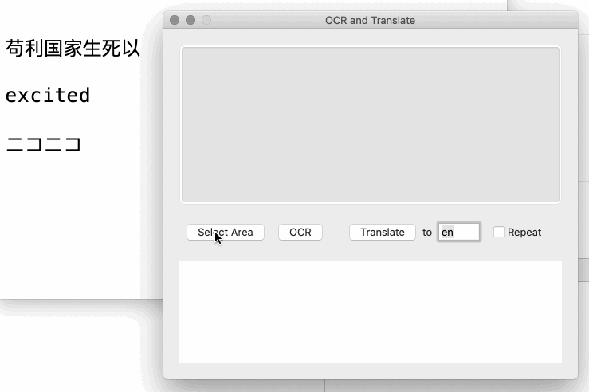

# OCR and Translate

Fun tool on **MacOS** for screenshoting then OCR and translate. Using Tesseract for OCR.

## How to use

Download or clone the project, open with Xcode and build it.

### Setup

1. The screen capture require previlege of Accessibility in System Preference -> Security & Privacy -> Privacy. It requires your mouse movement and click, so you need to grant permit to it.

2. OCR is from Tesseract. You can download more language models from [Tesseract's github page](https://github.com/tesseract-ocr/tessdata/tree/3.04.00), put them in 'tessdata' folder, then modify the OCR language parameter in preference to support more languages. Use [3.0 version's](https://github.com/tesseract-ocr/tessdata/tree/3.04.00).

3. Translate services now provide choices of Google and Yandex. You need to get translate service's API key and put it in preference. By now, Yandex provide free API service while Google charges around $20 per million char.

4. Can automatically repeat OCR & translating. May be useful for game or movie subtitles translation needed

## Credit

1. [Tesseract](https://github.com/tesseract-ocr/tesseract)

2. [Tesseract-macOS](https://github.com/scott0123/Tesseract-macOS)

3. [Google Translate Swift](https://github.com/maximbilan/SwiftGoogleTranslate)
